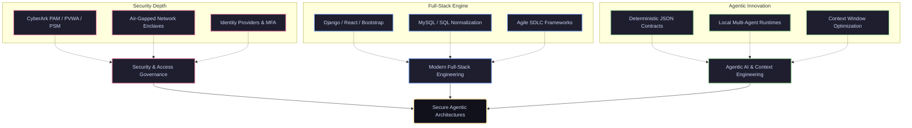

# 👋 Hi, I'm Nur Azhar  
**High-Ground Infrastructure & Agentic AI Architect**  
*Immediate Placement Target: Forward-Deployed / Solutions Engineering | Available Aug 3, 2026*  
*Singapore Citizen | H-1B1 Visa Eligible (Frictionless US Placement)*  
*Singapore | career@nurazhar.com | [linkedin.com/in/nur-azhar](https://linkedin.com/in/nur-azhar)*  

---

## 🚀 The Deterministic Anchor

I bridge the gap between autonomous AI agents, modern web architectures, and low-level, high-security infrastructure. My engineering foundation combines **7+ years of mission-critical depth** managing Privileged Access Management (PAM), CyberArk (PVWA/PSM), and air-gapped system governance within **National Defense Heritage & Mission-Critical Infrastructure** environments (Cat-2 / Official Secrets Act), reinforced by recent **Full Stack Web Development specialization at Lithan Academy (graduating late July 2026)**.

In the era of autonomous software, I treat AI agents as untrusted processes. I apply hardened network isolation concepts, deterministic data contracts, and decentralized identity protocols (including Bitcoin-native UTXO architectures) to secure agentic runtimes, prevent prompt injection/escape, and enforce strict execution boundaries.

---

## 🛠️ Technical Stack & Architecture

<table>
  <tr>
    <td valign="top" width="50%">
      <h3>🔐 Identity & Access Governance</h3>
      <ul>
        <li><b>Privileged Access Management:</b> CyberArk PVWA/PSM design, access policies</li>
        <li><b>Network Access Control:</b> Aruba ClearPass (NAC), Cisco VPN gateway policies</li>
        <li><b>Identity & Credentials:</b> Microsoft Entra ID, RSA SecurID, Phishing-resistant MFA (Passkeys / FIDO2)</li>
        <li><b>Air-Gapped Systems:</b> Enclave isolation, secure data transit</li>
      </ul>
    </td>
    <td valign="top" width="50%">
      <h3>⚙️ Systems & Agentic Orchestration</h3>
      <ul>
        <li><b>Agentic AI:</b> Local-first Multi-Agent Systems, Context Engineering</li>
        <li><b>Web Stack:</b> React, Django, Bootstrap, HTML5/CSS3, JavaScript (ES6+), jQuery</li>
        <li><b>Core Languages:</b> Python, Rust, Go, SQL, Clojure, C++</li>
        <li><b>Infrastructure & Cloud:</b> Linux (Arch, CachyOS, Debian), GCP, Cloudflare Serverless</li>
        <li><b>Databases & Auditing:</b> MySQL, PostgreSQL, SQLite (normalization & guardrails)</li>
      </ul>
    </td>
  </tr>
</table>

---

## 🔄 Agent-Augmented SDLC Methodology

I apply a hybrid, security-first software development life cycle tailored for speed and high robustness:

*   **Phase 1: Conceptual Design & Data Modeling**
    *   Developing Entity Relationship Diagrams (ERDs) and normalizing database schemas (MySQL/PostgreSQL) to avoid data redundancy and write bottlenecks.
    *   Threat modeling system entrypoints and user flow scenarios using UML schemas.
*   **Phase 2: High-Speed Agentic Synthesis**
    *   Utilizing advanced agentic IDE workflows (Cursor, custom CLI agents) to synthesize clean, functional modules (Django backends, React frontends) at high bandwidth.
    *   Drafting comprehensive unit and integration tests concurrently with code creation.
*   **Phase 3: Security Hardening & Isolation**
    *   Applying OWASP Top-10 defensive coding practices to web interfaces and APIs.
    *   Securing agent runtimes by parsing API inputs through strict, deterministic JSON-schema contract boundaries.
*   **Phase 4: Orchestration & Deployment**
    *   Packaging web services into lightweight Docker containers or managing virtual machines for reliable multi-environment staging.
    *   Establishing secure audit telemetry, database migrations, and operational backups.

---

## 📂 Selected Systems & Frameworks

### 🧠 [Local-First Multi-Agent Orchestration & Context Engineering Framework](https://github.com/nurazhardotcom/headhunter-agent)
*A privacy-preserving, local-first Multi-Agent System (MAS) built to orchestrate unstructured data processing and compilation.*
- **Tech Stack:** Python, Rust (native bindings for high-performance token/context manipulation), Typst, Gemini API.
- **Architectural Highlights:**
  - **Deterministic Data Contracts:** Hard JSON schemas ensuring state transitions between agents remain predictable.
  - **Privacy-by-Design:** Orchestrates sensitive personal context locally without raw data leaking to third-party endpoints.
  - **Pipeline Synthesis:** 3-stage agentic engine executing profile tokenization, typst resume compilation, and pre-interview strategic mapping.

### 🎵 [lagu-lagu](https://github.com/nurazhardotcom/lagu-lagu)
*A "No-Backend" stateless payout registry and direct settlement engine for independent musicians in Southeast Asia.*
- **Tech Stack:** HTML5, HTMX, Neon Serverless Postgres (PL/pgSQL triggers, RLS), Tazapay API, BSV Notary Ledger.
- **Architectural Highlights:**
  - **Zero-Server / Zero-Code Backend:** Deletes custom application middleware entirely, routing client-side HTMX queries directly to serverless Neon Postgres/PostgREST API endpoints.
  - **Declarative Database Security:** Enforces authentication and authorization natively at the database layer using Postgres Row-Level Security (RLS) policies.
  - **Stateless Notary Commits:** Commits Merkle root payment proofs to a public ledger (BSV) for $0.0001 per hash to establish clean title and block regional CMO suspense claims.
  - **Low-Toll E-Wallet Clearing:** Routes micro-payments from local e-wallets (GCash, PayNow) to artist accounts instantly via Tazapay, bypassing high credit card minimum fees ($0.30).

### 📈 [sol-de-tracker](https://github.com/nurazhardotcom/sol-de-tracker)
*A structured Data Engineering pipeline designed for real-time extraction and transactional reliability.*
- **Tech Stack:** Python, SQLite/PostgreSQL, Public APIs, automated workflows.
- **Architectural Highlights:** 
  - **Data Integrity:** Strict normalization schemas to ensure zero-loss storage of volatile market data.
  - **Resiliency:** Programmatic recovery, transactional boundary enforcement, and granular telemetry.

### 🛡️ [aur-audit](https://github.com/nurazhardotcom/aur-audit)
*A static analysis security auditing tool designed to inspect AUR PKGBUILD and install scripts for indicators of compromise (IoC) and system manipulation hooks.*
- **Tech Stack:** Clojure, Babashka, shell integration.
- **Architectural Highlights:**
  - **Zero-Dependency Scripting:** Executed via Babashka with near-instant startup, suitable for integration into CLI package update hooks (`paru`).
  - **Dynamic Rule Engine:** Uses deterministic regex heuristics to detect outbound sockets, base64 obfuscation, dynamic evaluation, and system persistence.
  - **Active Defense:** Built in response to the June 2026 AUR malicious update incident to prevent unsafe code execution on Arch-based systems.

### 🪙 Decentralized Identity & Protocol Security Research
*Auditing core consensus engines and peer-to-peer designs to architect decentralized identity primitives.*
- **[bsv-clj](https://github.com/nurazhardotcom/bsv-clj):** A Clojure toolkit exploring the immutable UTXO model. Built an idiomatic JSON-RPC client, read-only wallet module, and a Ring/Hiccup explorer. Illustrates the synergy between immutable ledger state and functional, data-oriented language design.
- **[bitcoin](https://github.com/nurazhardotcom/bitcoin):** Researching original P2P consensus, transaction verification scripts, and memory-safe validation rules in the core C++ codebase.
- **[Bitcoin-Wallet](https://github.com/nurazhardotcom/Bitcoin-Wallet):** Security audit of lightweight client structures (ElectrumSV) targeting cryptographic key isolation, transaction signatures, and server synchronization models.

---

## 📫 Contact & Verification
- **LinkedIn:** [linkedin.com/in/nur-azhar](https://linkedin.com/in/nur-azhar)
- **Email:** career@nurazhar.com
- **Core Node:** [nurazhar.com](https://nurazhar.com)
